# RobotStudy
Image Processing Study for Robot Programming

## 1. Environments

- Window 10
- Python 3.7.6
- python 3.8.5 (Anaconda)
- OpenCV
- Numpy

## 2. Study

### 2. 1 1st Week BGR Pixel Basic
This is `./RS_1week/Homework1_Temp.py`.

***
```python3
import cv2
import numpy as np

# 마우스 콜백 함수(마우스 이벤트 처리 함수)
def mouse_callback(event, x, y, flags, param):
  B, G, R = cv2.split(dst)                              # B, G, R 채널 분리
  if event == cv2.EVENT_LBUTTONDOWN:                    # 마우스 왼쪽버튼 클릭
    print(f'B: {B[y][x]}\nG: {G[y][x]}\nR: {R[y][x]}')  # 클릭좌표 픽셀의 BGR값 출력
    print(f'========================================')
```
- Mouse Callback Function(Mouse Event Processing Function).
- Print BGR Value of the Pixel at the clicked coordinates.

***
```python3
# 객체 검출 함수(메소드)
def object_detect(src, color):
    B, G, R = cv2.split(src)                                # B, G, R 채널 분리
    count = 0; quadrant = 0                                 # 객체에 해당하는 모든픽셀의 개수, 객체가 위치하는 사분면
    quadrant_row = 0                                        # 객체에 해당하는 모든픽셀의 height 합
    quadrant_col = 0                                        # 객체에 해당하는 모든픽셀의 width 합

    # 객체 검출 및 사분면 계산을 위한 변수 계산
    rows, cols = src.shape[:2]                              # 이미지 height, width
    for row in range(rows):
        for col in range(cols):
            if G[row][col] > 100 and R[row][col] > 150:     # 노란색인 픽셀이면
                dst[row, col, ...] = color                  # 해당 픽셀을 지정한 컬러로 변경
                quadrant_row += row                         # 해당 픽셀의 height 합산
                quadrant_col += col                         # 해당 픽셀의 width 합산
                count += 1                                  # 해당 픽셀을 count

    # 사분면 계산
    if count > 0:                                                                   # 객체가 검출 되었다면
        quadrant_row /= count                                                       # 객체가 검출된 모든픽셀의 height 합의 평균
        quadrant_col /= count                                                       # 객체가 검출된 모든픽셀의 width 합의 평균
        if quadrant_row < rows // 2 and quadrant_col > cols // 2: quadrant = 1      # 제 1사분면
        elif quadrant_row < rows // 2 and quadrant_col < cols // 2: quadrant = 2    # 제 2사분면
        elif quadrant_row > rows // 2 and quadrant_col < cols // 2: quadrant = 3    # 제 3사분면
        elif quadrant_row > rows // 2 and quadrant_col > cols // 2: quadrant = 4    # 제 4사분면, 가독성을 위해 else 미사용

    dst[rows//2, :, :] = COLOR_BLUE                         # 가로 파란 선
    dst[:, cols//2, :] = COLOR_BLUE                         # 세로 파란 선
    print(f'위치: 제{quadrant}사분면')                        # 객체가 위치하는 사분면 출력
    print(f'크기: {src.shape}')                              # 이미지 크기 출력
    return dst
```
- Obejct Detect Function.
- Detect in which quadrant an object is located.
- 객체에 해당하는 모든 픽셀의 Height/Width 합의 평균을 통해 사분면 도출.

***
```python3
# 이미지 경로 설정
Path = f'./Data/'
Name1 = f'rabong.jpg'
Name2 = f'rabong2.jpg'
FullName = Path + Name1

# 이미지 읽기
src = cv2.imread(FullName)      # 소스 이미지
dst = np.copy(src)              # 결과 이미지, 최초에는 소스 이미지 사본으로 사용

COLOR_RED = (0, 0, 255)         # RED Color 정의
COLOR_BLUE = (255, 0, 0)        # BLUE Color 정의

cv2.namedWindow('Result')                       # 출력 윈도우 Title 정의
cv2.setMouseCallback('Result', mouse_callback)  # 출력 윈도우 Title에 마우스 콜백함수 호출
while True:
    cv2.imshow('Result', dst)                   # Title이 Result인 윈도우에 매 프레임마다 영상(이미지) 출력
    dst = object_detect(src, COLOR_RED)         # 객체 검출, 검출한 객체는 RED Color로 칠하기

    # cv2.waitKey(time): time(ms)시간 동안 키 입력 대기, 0은 무한대기, 대기하는 동안 return 값은 -1
    key = cv2.waitKey(1)                        # 1ms 동안 입력 대기 = 매 1ms 마다 이미지 갱신
    if key == 27 or key == ord('q'): break      # ESC 또는 q를 입력하면 while loop 탈출
```
- Main Function.
- Print Result.
- 마우스 콜백은 윈도우 타이틀명으로 while문 밖에서 지정.
- 입력 데이터가 동영상 프레임일 경우를 대비하여 RealTime 객체검출을 위해 While문 안에서 객체검출 처리 및 이미지 출력처리.

***
Result
<p align="center">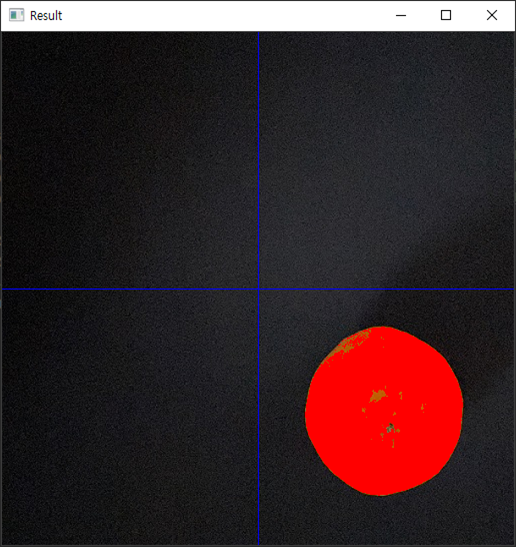</p>
<p align="center">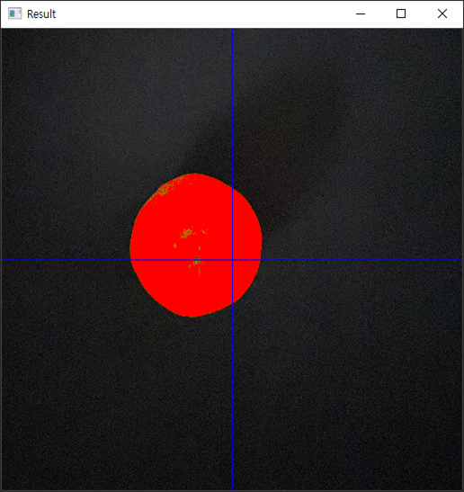</p>

***
### 2. 2 2nd Week Edge Detecting
This is `./RS_2week/04_Homework.py`.

```python3
import cv2
import numpy as np

PATH = './Data/'
NAME = 'lenna.tif'
NAME = 'test.jpg'
FILENAME = PATH + NAME

src = cv2.imread(FILENAME, cv2.IMREAD_GRAYSCALE)
```
- Import Packages.
- Basic PATH, IMG_NAME definition.
- Read image file.

***
```python3
# 로버츠 크로스 커널 생성
roberts_kernelX = np.array([[-1, 0, 0], [0, 1, 0], [0, 0, 0]])
roberts_kernelY = np.array([[0, 0, -1], [0, 1, 0], [0, 0, 0]])
roberts_kernelXY = roberts_kernelX + roberts_kernelY

# 로버츠 크로스 커널 필터 적용
robertsX = cv2.filter2D(src, -1, roberts_kernelX)
robertsY = cv2.filter2D(src, -1, roberts_kernelY)
robertsXY = cv2.filter2D(src, -1, roberts_kernelXY)

# 결과 출력
dst1 = np.hstack((src, robertsX, robertsY, robertsX + robertsY))
dst2 = np.hstack((src, robertsX, robertsY, robertsXY))
dst = np.vstack((dst1, dst2))
cv2.imshow('Roberts Cross Filter', dst)
```
Roberts Cross Filter
- 기본 미분 필터를 개선, 대각선 방향으로 +-1을 배치
- 사선 경계 검출 효과, 노이즈에 민감

***
```python3
# 프리윗 커널 생성
prewitt_kernelX = np.array([[-1, 0, 1], [-1, 0, 1], [-1, 0, 1]])
prewitt_kernelY = np.array([[-1, -1, -1], [0, 0, 0], [1, 1, 1]])
prewitt_kernelXY = prewitt_kernelX + prewitt_kernelY

# 프리윗 커널 필터 적용
prewittX = cv2.filter2D(src, -1, prewitt_kernelX)
prewittY = cv2.filter2D(src, -1, prewitt_kernelY)
prewittXY = cv2.filter2D(src, -1, prewitt_kernelXY)

# 결과 출력
dst1 = np.hstack((src, prewittX, prewittY, prewittX + prewittY))
dst2 = np.hstack((src, prewittX, prewittY, prewittXY))
dst = np.vstack((dst1, dst2))
cv2.imshow('Prewitt Filter', dst)
```
Prewitt Filter
- x, y축 각 방향으로 차분을 3번 계산
- 상하좌우 경계 검출 효과, 대각선 검출 약함

***
```python3
# 소벨 커널 생성 (직접 생성 방식)
sobel_kernelX = np.array([[-1, 0, 1], [-2, 0, 2], [-1, 0, 1]])
sobel_kernelY = np.array([[-1, -2, -1], [0, 0, 0], [1, 2, 1]])
sobel_kernelXY = sobel_kernelX + sobel_kernelY

# 소벨 커널 필터 적용
sobelX = cv2.filter2D(src, -1, sobel_kernelX)
sobelY = cv2.filter2D(src, -1, sobel_kernelY)
sobelXY = cv2.filter2D(src, -1, sobel_kernelXY)

# 결과 출력
dst1 = np.hstack((src, sobelX, sobelY, sobelX + sobelY))
dst2 = np.hstack((src, sobelX, sobelY, sobelXY))
dst = np.vstack((dst1, dst2))
cv2.imshow('Sobel Filter1', dst)
```
Sobel Filter1
- 중심 픽셀의 차분 비중을 2배로 줌
- x, y축 대각선 방향의 경계 검출에 모두 강함

***
```python3
# 소벨 커널 필터 적용2 (OpenCV 내장 함수 사용)
sobelX = cv2.Sobel(src, -1, 1, 0, ksize=3)
sobelY = cv2.Sobel(src, -1, 0, 1, ksize=3)
sobelXY = sobelX + sobelY

# 결과 출력
dst = np.hstack((src, sobelX, sobelY, sobelXY))
cv2.imshow('Sobel Filter2', dst)

cv2.waitKey()
cv2.destroyAllWindows()
```
Sobel Filter2
- 로버츠와 프리윗은 현재 잘 쓰이지 않음
- 소벨은 실무적으로도 쓰이므로 OpenCV에서 별도의 함수를 제공함

***
Result
- Roberts Cross, Prewitt Filter는 잘 쓰이지 않음.
- Sobel Filter는 대각선 검출 및 실무적으로 사용되므로 Sobel Filter를 사용하는 것이 좋다.
- 결과에서는 가로세로필터 더한 후 적용하는 것이 깔끔하나, OpenCV 내장 함수로 지원하고 있고,
  코드를 간결하게 작성할 수 있기 때문에 OpenCV Sobel을 사용하는 것이 좋을 것으로 추정된다.
<p align="center">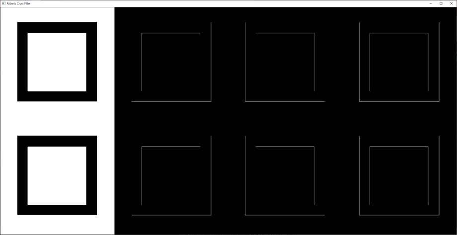</p>
<p align="center">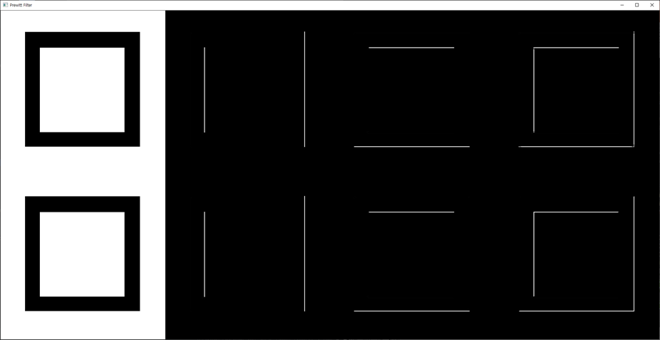</p>
<p align="center">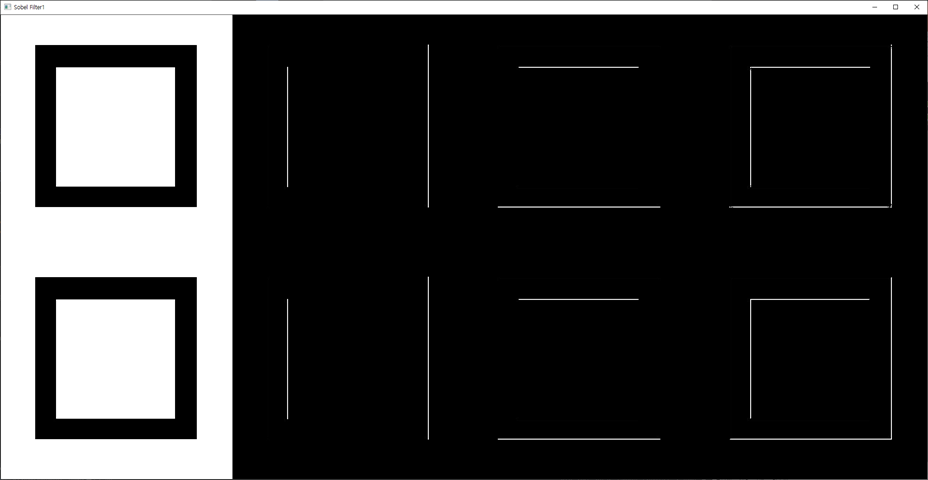</p>
<p align="center">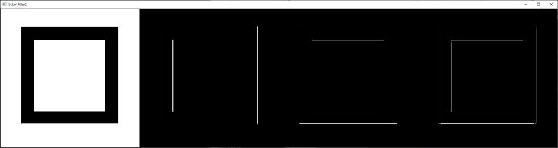</p>

***
### 2. 3 3rd Week Edge Detecting
This is `./RS_3week/Homework.py`.

```python3
import cv2
import numpy as np

Path = './Data/'
Name = 'homework.jpg'
FullName = Path + Name
src = cv2.imread(FullName)     # image size : (429, 697)
```
- Import Packages.
- Basic PATH, IMG_NAME definition.
- Read image file.

***
```python3
# 1) 주어진 이미지 Gray Scale 변환
img = cv2.cvtColor(src, cv2.COLOR_BGR2GRAY)
```
GrayScale
- 주어진 이미지를 Gray Scale로 변환.

***
```python3
# 2) 이미지 Blurring 처리
gauss_filter = cv2.getGaussianKernel(5, 3)      # Blur 처리방법1: 커널 구하기
img1 = cv2.filter2D(img, -1, gauss_filter)      # Blur 처리방법1: 공간필터링 적용
img2 = cv2.GaussianBlur(img, (5, 5), 3)         # Blur 처리방법2: 내장함수로 한번에 적용
```
Gaussian Blurring
- 공간필터를 이용한 가우시안 블러 적용.
- 내장함수를 이용한 가우시안 블러 적용.

***
Result
- 동일한 `Kennel`과 `Sigma`값을 사용.
- `cv2.GaussianBlur`가 더 효과가 좋음.
```python3
cv2.imshow('Gaussian Filter', img1)             # 공간필터를 이용한 Blur 결과
cv2.imshow('Gaussian Blur', img2)               # 내장함수를 이용한 Blur 결과
```
<p align="center"></p>
<p align="center">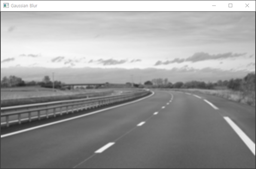</p>

***
```python3
# 3) Canny Edge로 Edge만 검출
img1 = cv2.Canny(img1, 50, 200)                 # minVal: 50 | maxVal: 200
img2 = cv2.Canny(img2, 50, 200)                 # minVal: 50 | maxVal: 200
```
Canny Edge
- 내장함수를 이용한 `Canny Edge`.
- 두 `Gaussian Blurring` 방식에 따른 결과 확인을 위해 동일한 `minVal` & `maxVal` `thresholds`값 사용

***
```python3
# 4) ROI로 차선 부분만 추출: 직사각형이 아닌 사다리꼴 등의 다각형으로 ROI 할 때 사용
def region_of_interest(src, vertices, color=(255, 255, 255)):
    if len(src.shape) < 3:                  # 1 Channel = Gray Scale:
        color = 255                         # Gray Scale Color Default 흰색 설정
    mask = np.zeros_like(src)               # src와 같은 크기의 빈 이미지
    cv2.fillPoly(mask, vertices, color)     # vertices 좌표로 구성된 다각형 범위내부를 color로 채움
    dst = cv2.bitwise_and(src, mask)        # src & ROI 이미지 합침
    return dst
```
```python3
# 5) Vertices Point Setting:
# np.array([[Top Left], [Top Right], [Bottom Right], [Bottom Left]])
# 수평을 기준으로 아래쪽 절반 선택
height, width = img.shape[:2]
point = np.array([[0, height // 2], [width, height // 2], [width, height], [0, height]])
roi1 = region_of_interest(img1, [point])
roi2 = region_of_interest(img2, [point])
```
ROI(Region Of Interest)
- 직사각형이 아닌 사다리꼴 등의 다각형으로 검출범위를 축소하는 사용자 정의 함수.
- 필터를 적용할 ROI 범위 지정.
- 다각형의 범위는 개발자의 판단에 따름.
- 본 코드에서는 이미지의 중앙을 기준으로 하단 절반의 이미지를 지정.

***
Result
- `cv2.GaussianBlur` 함수를 사용한 결과가 더 좋지 못함.
- Blur 효과가 더 강해서 발생한 결과로 추정.
```python3
cv2.imshow('ROI1', roi1)
cv2.imshow('ROI2', roi2)
cv2.waitKey()
cv2.destroyAllWindows()
```
<p align="center">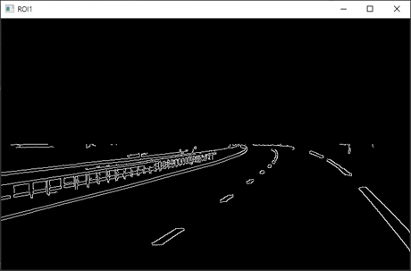</p>
<p align="center">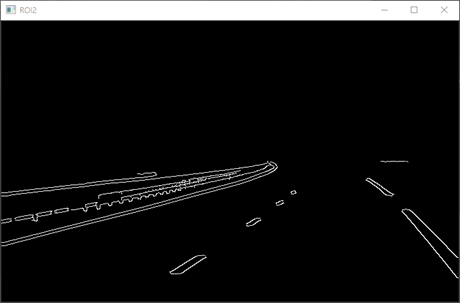</p>
Conclusion
- `Gaussian Blurring`은 `Kennel`을 이용한 공간필터링으로 수행하는 것이 더 높은 정확도를 나타낸다.
- 실전에서 `ROI`의 다각형 범위를 잘 지정하는 것이 더 높은 정확도를 위한 관건이 될 것이다.

***
### 2. 4 4th Week Hough Transform
This is `./RS_4week/homework4_Temp.py`.
```python3
import cv2
import numpy as np

########################################################################################################################
# Define Data Path
Path = './Data/'
Name = 'drive.mp4'
FileName = Path + Name

########################################################################################################################
# Define Color
BLACK = (0, 0, 0)
WHITE = (255, 255, 255)
RED = (0, 0, 255)
GREEN = (0, 255, 0)
BLUE = (255, 0, 0)
```
- Import Packages.
- Basic PATH, IMG_NAME definition.
- Basic Color RGB Value definition.

***
```python3
# Define Image Processing Method
# ROI: 다각형 마스킹, 사다리꼴 등의 다각형으로 마스킹 할 때 사용
def region_of_interest(src, vertices, color=BLACK):
    if len(src.shape) < 3:                  # 1 Channel = Gray Scale:
        color = 255                         # Gray Scale Color Default 흰색 설정
    mask = np.zeros_like(src)               # src 와 같은 크기의 빈 이미지
    cv2.fillPoly(mask, vertices, color)     # vertices 좌표로 구성된 다각형 범위내부를 color로 채움
    dst = cv2.bitwise_and(src, mask)        # src & ROI 이미지 합침
    return dst
```
ROI(Region Of Interest)
- 직사각형이 아닌 사다리꼴 등의 다각형으로 검출범위를 축소하는 사용자 정의 함수.
- 필터를 적용할 ROI 범위 지정.
- 다각형의 범위는 개발자의 판단에 따름.
- 본 코드에서는 이미지의 중앙을 기준으로 하단 절반의 이미지를 지정.

***
```python3
# Main Routine
Nframe = 0                                                  # Frame 수
scale = 1500                                                # Scale for Multi-Scale Hough Transform
capture = cv2.VideoCapture(FileName)                        # VideoCapture
while True:
    ret, frame = capture.read()                             # Video Load 성공하면 True, Frame 반환
    if ret == True:                                         # Video Load 성공했다면
        Nframe += 1                                         # Increase Frame Count
        frame = cv2.resize(frame, (0, 0), fx=0.4, fy=0.4)   # Frame Resize 0.4
        dst = cv2.cvtColor(frame, cv2.COLOR_BGR2GRAY)       # BGR2GRAY 변환
        dst = cv2.GaussianBlur(dst, (5, 5), 3)              # Gaussian Blurring, 내장함수로 한번에 적용
        dst = cv2.Canny(frame, 50, 200, None, 3)            # Canny Edge 검출, 3Channel 도 GrayScale 로 반환
        dst1 = cv2.cvtColor(dst, cv2.COLOR_GRAY2BGR)        # 결과비교 출력을 위한 GRAY2BGR 변환, hstack/vstack 사용을 위함
        dst2 = cv2.cvtColor(dst, cv2.COLOR_GRAY2BGR)        # 결과비교 출력을 위한 GRAY2BGR 변환, hstack/vstack 사용을 위함

        # Vertices Point Setting, 수평을 기준으로 아래쪽 절반 선택
        # np.array([[Top Left], [Top Right], [Bottom Right], [Bottom Left]])
        height, width = dst.shape[:2]; middle = height // 2
        point = np.array([[0, middle], [width, middle], [width, height], [0, height]])
        roi = region_of_interest(dst, [point])

        # 표준 허프 변환(Standard Hough Transform) & 멀티 스케일 허프 변환(Multi-Scale Hough Transform)
        lines = cv2.HoughLines(roi, 1, np.pi / 180, 150, None, 0, 0)        # 표준 허프 변환
        if lines is not None:                                               # 직선이 검출 되었다면
            for line in lines:                                              # 각 직선에 대해
                rho, theta = line[0]                                        # 극좌표
                a, b = np.cos(theta), np.sin(theta)                         # xy좌표 변환 과정
                x0, y0 = a * rho, b * rho                                   # xy좌표 변환 결과
                x1, y1 = int(x0 + scale * (-b)), int(y0 + scale * a)        # 직선의 스케일 평행이동을 통한 시작점 좌표계산
                x2, y2 = int(x0 - scale * (-b)), int(y0 - scale * a)        # 직선의 스케일 평행이동을 통한 종료점 좌표계산
                cv2.line(frame, (x1, y1), (x2, y2), GREEN, 3, cv2.LINE_AA)  # 결과이미지에 선그리기
                cv2.line(dst1, (x1, y1), (x2, y2), GREEN, 3, cv2.LINE_AA)   # 결과이미지에 선그리기

        # 점진성 확률적 허프 변환(Progressive Probabilistic Hough Transform)
        linesP = cv2.HoughLinesP(roi, 1, np.pi / 180, 50, None, 50, 10)     # 확률적 허프 변환
        if linesP is not None:                                              # 직선이 검출 되었다면
            for line in linesP:                                             # 각 직선에 대해
                points = line[0]                                            # 직선의 좌표모음
                x1, y1 = points[0], points[1]                               # 직선의 시작점 좌표
                x2, y2 = points[2], points[3]                               # 직선의 종료점 좌표
                cv2.line(frame, (x1, y1), (x2, y2), RED, 3, cv2.LINE_AA)    # 결과이미지에 선그리기
                cv2.line(dst2, (x1, y1), (x2, y2), RED, 3, cv2.LINE_AA)     # 결과이미지에 선그리기

        # 결과 프레임 별 텍스트 추가
        text1 = 'Source Video'
        text2 = 'ROI Video'
        text3 = 'Standard Hough Line Transform'
        text4 = 'Probabilistic Line Transform'
        cv2.putText(frame, text1, (20, 30), cv2.FONT_HERSHEY_SIMPLEX, 1, BLACK, 2, cv2.LINE_AA)
        cv2.putText(roi, text2, (20, 30), cv2.FONT_HERSHEY_SIMPLEX, 1, WHITE, 2, cv2.LINE_AA)
        cv2.putText(dst1, text3, (20, 30), cv2.FONT_HERSHEY_SIMPLEX, 1, GREEN, 2, cv2.LINE_AA)
        cv2.putText(dst2, text4, (20, 30), cv2.FONT_HERSHEY_SIMPLEX, 1, RED, 2, cv2.LINE_AA)

        # 결과출력
        roi = cv2.cvtColor(roi, cv2.COLOR_GRAY2BGR)     # 결과비교 출력을 위한 GRAY2BGR 변환, hstack/vstack 사용을 위함
        merged1 = np.hstack((frame, roi))               # 수평합병, Source Video + ROI Video
        merged2 = np.hstack((dst1, dst2))               # 수평합병, Standard + Probabilistic
        merged = np.vstack((merged1, merged2))          # 수직합병
        cv2.imshow('Hough Convert', merged)             # 결과출력

    key = cv2.waitKey(1)                    # 키보드 입력대기
    if key == 27 or key == ord('q'):        # ESC, q 를 입력하면
        break                               # 종료

print(f'Number of Frame: {Nframe}')         # 영상의 frame 수 출력
capture.release()                           # Video Release
cv2.destroyAllWindows()                     # Destroy All Windows
```
Main Routine
- 정확도를 높이기 위해 `GaussianBlur`를 적용하고, `CannyEdge`를 사용하여 직선검출.
- 필터를 적용할 `ROI`범위 지정, 다각형의 범위는 개발자의 판단에 따름.
- 본 코드에서는 이미지의 중앙을 기준으로 하단 절반의 이미지를 지정.
- 전처리가 완료된 `Edge`이미지를 사용해 `표준 허프변환` 진행.
- 반환된 극좌표계를 `x-y`좌표계로 변환하여, 직선의 방정식 선분을 따라 평행이동시켜 선을 그림.
- 결과영상을 구분짓는 텍스트를 결과영상에 추가.
- 프레임 수 출력 및 종료조건 처리.
 
부가실험
- 전처리가 완료된 `Edge`이미지를 사용해 `점진성 허프변환` 진행.
- 해당함수는 자동으로 검출된 직선을 `x-y`좌표계로 변환하여, 반환된 좌표를 통해 선을 그림.

***
Result
- `원본영상`, `ROI영상`, `표준허프변환`, `확률적허프변환`
- 출력결과 주어진 데이터가 418프레임 확인.
<p align="center">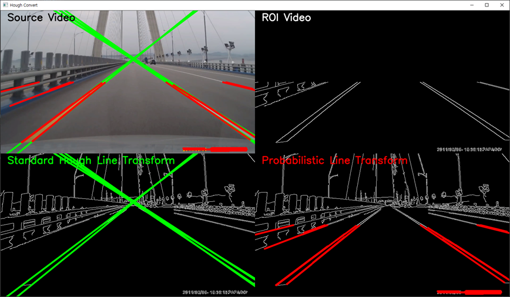</p>
<p align="center">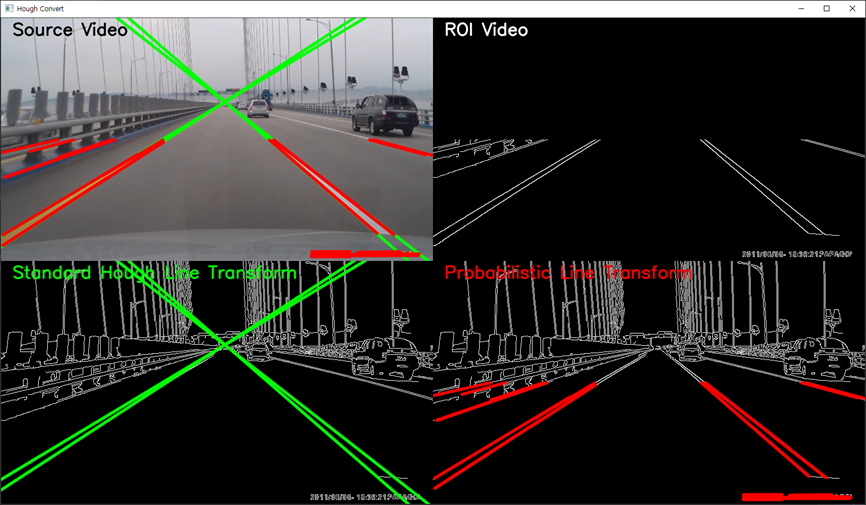</p>
<p align="center">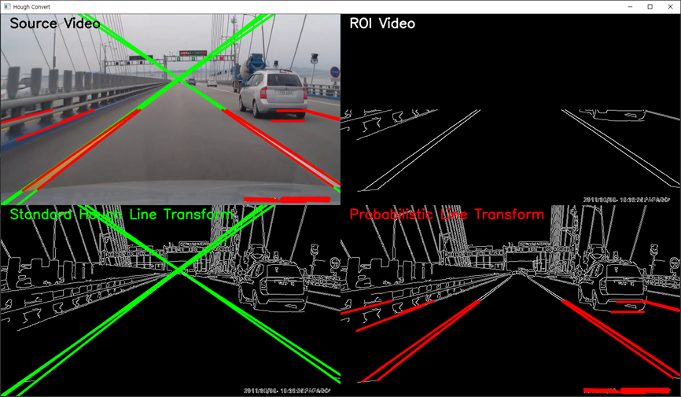</p>
<p align="center">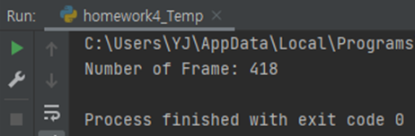</p>
Conclusion
- `ROI영상`을 통해 `표준허프변환`이 꽤 정확하게 차선을 검출했음을 확인.
- `확률적허프변환`도 대체적으로 잘 검출했으나, 가드레일을 차선으로 검출하거나, 앞 차의 뒷 범퍼를 차선으로 검출하는 등
  `표준허프변환`에 비해 정확도가 다소 떨어짐을 확인.
